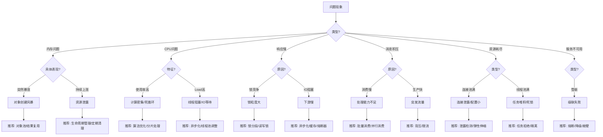
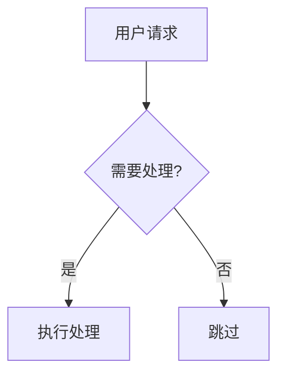

# 性能问题诊断参考

详细的诊断决策树、反模式警示、优化模式等参考内容。

## 目录
- [症状→诊断→处方决策树](#症状诊断处方决策树)
- [云原生资源陷阱](#云原生资源陷阱-cloud-native-pitfalls)
- [稳定性保障模式](#稳定性保障模式-resilience-patterns)
- [性能反模式进阶](#性能反模式进阶-advanced-anti-patterns)
- [快速诊断表](#快速诊断表)
- [反模式警示](#反模式警示)
- [日志算术参考](#日志算术参考-log-math)
- [诊断工具推荐](#诊断工具推荐)
- [详细分析方法](#详细分析方法)

---

## 症状→诊断→处方决策树

根据问题现象，推荐优化模式：



---

## 多语言诊断特征表 (Polyglot Diagnostics)

不同语言的运行时行为差异巨大，请勿生搬硬套 JVM 理论。

| 维度 | **Java (JVM)** | **Go (Golang)** | **Node.js (V8)** |
|------|----------------|-----------------|------------------|
| **内存模型** | 堆分代 (Young/Old), 复杂的 GC 算法 (G1/ZGC) | 无分代 (一直混合 GC), Scavenge 很少 | 堆分代 (Scavenge/Mark-Sweep) |
| **OOM 特征** | `java.lang.OutOfMemoryError` (堆满) | `runtime: out of memory` (通常直接 Crash) | `FATAL ERROR: Ineffective mark-compacts` |
| **CPU 瓶颈** | 线程切换, 锁竞争, GC | Goroutine 调度, 锁自旋 | **Event Loop 阻塞** (单线程被卡死) |
| **并发模型** | Thread (OS 线程) | Goroutine (M:N 调度) | Event Loop + Worker Threads |
| **关键物料** | Jstack, Heap Dump (hprof) | **pprof** (goroutine, heap, profile) | **Heap Snapshot**, Clinic Doctor |
| **常见陷阱** | 线程池耗尽, Full GC | **Goroutine 泄露**, Channel 阻塞 | **同步代码阻塞 EventLoop**, Promise 链过长 |

---

## 云原生资源陷阱 (Cloud Native Pitfalls)

在 Docker/Kubernetes 环境下，应用看到的资源可能与实际限制不符。

### 1. 容器配额限制 (Cgroups)
**现象**：应用没报 OOM，但容器直接重启 (OOMKilled)。
**原因**：应用内存 (App Memory) > 容器限制 (K8s Limits)。
**检查**：
- `cat /sys/fs/cgroup/memory/memory.limit_in_bytes`
- 检查 K8s YAML: `resources.limits.memory`
- **反模式**：Java `Xmx` 设置为 4G，但 K8s Limit 设置为 2G。

### 2. CPU 节流 (CPU Throttling)
**现象**：CPU 使用率看似不高，但响应极慢。
**原因**：CFS Quota 限制。应用在短时间内用光了 CPU 配额，被 OS 强制挂起 (Throttled)。
**检查**：
- `cat /sys/fs/cgroup/cpu/cpu.stat` (看 `nr_throttled`)
- **反模式**：设置了过于严格的 `resources.limits.cpu` (如 100m)，导致启动时或高负载时被频繁节流。

---

## 稳定性保障模式 (Resilience Patterns)

### 1. 舱壁模式 (Bulkhead)
**原理**：像船舱一样隔离资源，防止一个模块的故障耗尽所有资源（如线程池）。
**实现**：
- 为核心业务（如下单）和非核心业务（如日志上报）使用**独立的线程池**。
- 为不同的下游依赖（如 Redis, MySQL, 外部API）设置独立的连接池配额。

### 2. 熔断与降级 (Circuit Breaker)
**原理**：下游不可用时，快速失败，避免线程阻塞。
**反模式**：
- `catch (Exception e) { return null; }` (单纯吞掉异常不是降级)
- **正确做法**：使用 Resilience4j/Sentinel，配置失败率阈值，触发熔断后直接返回缓存值或默认值。

### 3. 防止重试风暴 (Retry Storm Prevention)
**现象**：N 个客户端同时超时，同时重试，流量瞬间翻倍，彻底压垮服务端。
**解决方案**：
- **指数退避 (Exponential Backoff)**: 第1次等1s，第2次等2s，第4次等4s...
- **随机抖动 (Jitter)**: `wait_time = base * 2^n + random(0, 100ms)`
- **熔断联动**: 下游挂了就禁止重试。

---

## 性能反模式进阶 (Advanced Anti-Patterns)

### 反模式 8: 线程爆炸 (Thread Explosion)
**现象**：使用 `CachedThreadPool` 或为每个请求创建一个线程。
**后果**：
- **CPU 浪费**：CPU 忙于在数千个线程间切换 (Context Switch)，没空执行业务。
- **OOM**：每个线程栈占用 1MB 内存。
**监控**：`vmstat` 查看 `cs` (context switch) 列；`jstack` 查看线程总数。

### 反模式 9: 伪共享 (False Sharing)
**现象**：多线程高频修改位于同一个缓存行 (Cache Line, 64 bytes) 的不同变量。
**后果**：CPU 缓存失效，性能剧降。
**解决**：使用 `@Contended` (Java 8+) 或手动填充字段 (Padding)。

---

## 快速诊断表

| 症状 | 可能原因 | 推荐模式 |
|------|----------|----------|
| 内存问题 | 对象创建风暴、资源泄露 | 对象池、生命周期管理 |
| CPU问题 | 死循环、正则回溯、锁竞争 | 算法优化、锁分段 |
| 响应慢 | IO阻塞、锁竞争、下游慢 | 异步化、熔断、缓存 |
| 资源耗尽 | 连接池/线程池满、句柄泄露 | 资源复用、背压、弹性配置 |
| 服务不可用 | 雪崩、级联失败 | 熔断、降级、舱壁模式 |
| 消息积压 | 消费慢、突发流量 | 批量消费、并行消费 |

---

## 反模式警示

### 反模式 1: 锁内执行 IO 操作

```java
// [错误] 锁内执行网络调用
synchronized (lock) {
    String result = httpClient.get(url);  // 阻塞其他线程!
    cache.put(key, result);
}

// [正确] 先获取数据，再加锁
String result = httpClient.get(url);  // 锁外执行
synchronized (lock) {
    cache.put(key, result);  // 只保护写操作
}
```

### 反模式 2: 循环内创建对象

```java
// [错误] 每次循环都创建对象
for (int i = 0; i < 10000; i++) {
    StringBuilder sb = new StringBuilder();  // 创建1万个对象!
    sb.append(data[i]);
    process(sb.toString());
}

// [正确] 复用对象
StringBuilder sb = new StringBuilder();
for (int i = 0; i < 10000; i++) {
    sb.setLength(0);  // 重置而非新建
    sb.append(data[i]);
    process(sb.toString());
}
```

### 反模式 3: 无界队列

```java
// [错误] 无界队列，可能 OOM
ExecutorService executor = Executors.newFixedThreadPool(10);
// 内部使用 LinkedBlockingQueue 无界队列!

// [正确] 有界队列 + 拒绝策略
ExecutorService executor = new ThreadPoolExecutor(
    10, 10, 0L, TimeUnit.MILLISECONDS,
    new ArrayBlockingQueue<>(1000),  // 有界队列
    new ThreadPoolExecutor.CallerRunsPolicy()  // 背压
);
```

### 反模式 4: 双重检查锁错误实现

```java
// [错误] 没有 volatile
private static Instance instance;
if (instance == null) {
    synchronized (lock) {
        if (instance == null) {
            instance = new Instance();  // 可能看到未初始化完成的对象!
        }
    }
}

// [正确] 使用 volatile
private static volatile Instance instance;  // 添加 volatile
```

### 反模式 5: 缓存穿透与惊群效应 (Cache Stampede)

**现象**：缓存失效瞬间，大量请求同时穿透到数据库。

```java
// [错误] 所有线程同时查库
public User getUser(Long id) {
    User user = cache.get(id);
    if (user == null) {
        user = db.query(id);  // 100个线程同时执行!
        cache.put(id, user);
    }
    return user;
}

// [正确] 使用互斥锁或 singleflight
public User getUser(Long id) {
    User user = cache.get(id);
    if (user == null) {
        synchronized (("user:" + id).intern()) {  // 锁粒度为单个 key
            user = cache.get(id);  // double-check
            if (user == null) {
                user = db.query(id);
                cache.put(id, user);
            }
        }
    }
    return user;
}
```

### 反模式 6: 放大效应 (Amplification)

**现象**：单个请求触发了下游的 N 次操作，或者广播给了 M 个终端。

```java
// [错误] 1->N 放大
// 每次循环都发起一次 DB/RPC 调用
List<User> users = userDao.getUsers(); // 1次
for (User user : users) {
    userProfileDao.getProfile(user.getId()); // N次! (N+1 问题)
}

// [正确] 批量操作
List<Long> userIds = users.stream().map(User::getId).collect(toList());
userProfileDao.getProfiles(userIds); // 1次
```

```java
// [错误] 全量广播放大
// 只要有一个人加入，就给全员发完整的 MemberList (假设有 1000 人)
// 流量 = 1000 * SizeOf(MemberList)
broadcast(new MemberList(allMembers));

// [正确] 增量广播
// 只发送变化的事件
broadcast(new MemberJoinedEvent(newMember));
```

### 反模式 7: 框架陷阱 (Framework Pitfalls)

| 框架 | 陷阱 | 描述 |
|------|------|------|
| **Akka** | Unbounded Mailbox | 默认邮箱无界，消费慢时内存无限积压导致 OOM |
| **Reactor** | EmitterProcessor | (旧版) 默认无界缓冲，下游消费慢时积压 |
| **Netty** | EventLoop 阻塞 | 在 IO 线程 (EventLoop) 中执行耗时业务逻辑 (如 DB)，导致整个 Reactor 卡死 |
| **Netty** | ByteBuf 泄露 | 使用 `ReferenceCounted` 对象未释放，导致堆外内存泄露 |
| **Hibernate** | Session 膨胀 | 长期持有的 Session 缓存了所有查询过的对象 (一级缓存) |

---

## 日志算术参考 (Log Math)

通过日志统计来量化问题严重程度：

**1. 放大倍数 (Amplification Factor)**
$$ A = \frac{\text{执行次数 (下游/推送)}}{\text{触发次数 (上游/请求)}} $$
- $A \approx 1$: 正常
- $A > 10$: 存在轻微放大
- $A > 100$: **严重放大 (P0 级问题)**

**2. 浪费率 (Waste Rate)**
$$ W = 1 - \frac{\text{有效操作数 (数据变更)}}{\text{总操作数 (执行次数)}} $$
- $W > 50\%$: 低效
- $W > 90\%$: **极度浪费 (通常意味着缺少 Dirty Check)**

---

## Mermaid 语法规范

**避免语法错误的规则：**

1. **不要使用 emoji** - 禁止使用特殊符号，用文字替代
2. **特殊字符需要引号** - 包含括号、冒号的标签用双引号包裹
3. **中文标签加引号** - 更安全

**正确示例：**


---

## 诊断工具推荐

| 问题类型 | 推荐工具 | 用途 |
|----------|----------|------|
| 内存问题 | jmap, MAT, async-profiler (alloc) | 堆分析、内存泄露定位 |
| CPU问题 | async-profiler (itimer/wall), perf | 火焰图、热点代码分析 |
| 响应慢/锁 | jstack, arthas (trace/stack) | 线程阻塞分析、方法耗时 |
| 资源耗尽 | lsof, netstat, arthas (dashboard) | 句柄/连接数监控 |
| 消息积压 | mqadmin, kafka-consumer-groups | 积压量 (Lag) 监控 |
| 服务不可用 | tshark, tcpdump | 网络抓包、协议分析 |

---

## 详细分析方法

### 侦察 (Reconnaissance)

- **技术栈识别**：读取 `pom.xml`/`build.gradle`
- **关键指纹匹配**：
  - `akka`, `actor` → Akka 检查 (Mailbox, Dispatcher)
  - `reactor`, `webflux` → Reactive 检查 (Backpressure)
  - `netty` → Netty 检查 (ByteBuf泄露, EventLoop阻塞)
  - `mybatis`, `hibernate` → ORM 检查 (N+1, 缓存)
- **云原生检查**：确认 `Xmx` 与 `resources.limits` 是否冲突

### 关键词搜索

| 问题类型 | 搜索模式 |
|----------|----------|
| CPU | `while(true)`, `json.Marshal`, `Protobuf.parse` |
| 内存 | `new .*List`, `stream.*collect`, `static Map` |
| 放大 | `forEach`, `broadcast`, `.tell(`, `for (` |
| 资源 | `ConnectTimeout`, `max-threads`, `max-connections` |
| 超时 | `synchronized`, `Thread.sleep`, `lock` |

**安全搜索规则**：
```bash
--exclude-dir={node_modules,target,.git,build} | head -n 20
```

### 日志分析

- **大文件防御**：严禁 `cat` 超过 100MB 日志，使用 `tail -n 500` 或 `grep ERROR | head`
- **Trace ID 抽样**：提取一个 trace_id，跨文件搜索还原请求链路
- **日志算术**：计算放大倍数 = 执行次数 / 触发次数

### 症状关联矩阵

| 组合现象 | 可能根因 | 验证方向 |
|----------|----------|----------|
| CPU高 + 吞吐低 | 锁竞争 | 检查 synchronized |
| CPU高 + 频繁GC | GC Thrashing | 优先排查内存 |
| 延迟高 + CPU低 | IO阻塞 | 检查下游超时 |
| OOM + 流量突增 | 无界队列 | 检查 LinkedBlockingQueue |

### GC 诊断表

| GC 现象 | 诊断结论 | 应对策略 |
|---------|----------|----------|
| Full GC 后内存大降 | Memory Churn | 优化对象创建 |
| Full GC 后内存居高 | Memory Leak | 搜索 static Map |
| Young GC 极频繁 | 分配过快 | 扩容 Eden |

