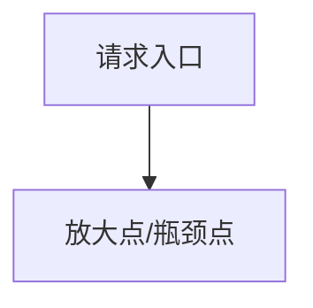
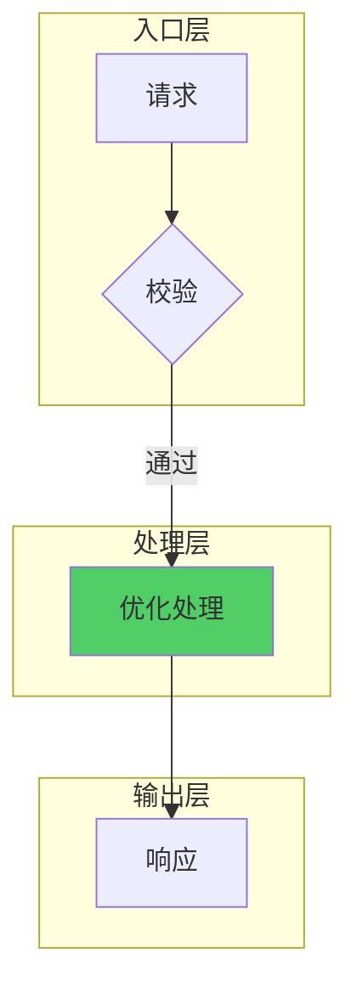

# [系统名称] 高并发优化方案

> **版本**: 1.0  
> **日期**: YYYY-MM-DD  
> **分类**: [内存/CPU/响应慢/资源耗尽/稳定性/消息积压/其他]
> **目标**: [优化目标，如：P99 响应时间 < 100ms]

---

## 一、问题背景

### 1.1 问题现象

| 指标 | 当前值 | 目标值 | 差距 |
|------|--------|--------|------|
| 峰值 QPS | | | |
| P99 延迟 | | | |
| 错误率 | | | |
| CPU 使用率 | | | |
| 内存使用 | | | |

### 1.2 应急止血方案 (Mitigation) - **优先执行**
**在修复代码前，建议通过以下手段快速恢复服务：**

| 方案 | 操作 | 预计效果 | 风险 |
|------|------|----------|------|
| **重启/扩容** | `kubectl scale ...` | 暂时缓解内存/CPU压力 | 成本增加 |
| **降级/熔断** | 关闭 [非核心功能] 开关 | 释放资源给核心业务 | 部分功能不可用 |
| **限流** | 限制入口 QPS < [阈值] | 防止雪崩 | 部分用户请求失败 |
| **配置调整** | 调大线程池/连接池 | 缓解排队 | 下游压力增大 |

### 1.3 故障时间轴 (Timeline)

```mermaid
timeline
    title 故障演进时序
    09:00 : 流量突增
          : 缓存失效
    09:01 : DB 连接数飙升
          : 线程池满
    09:03 : 服务 OOM / 宕机
```

### 1.4 瓶颈分析



### 1.3 放大效应量化 (核心)

| 放大环节 | 位置 | 放大因子 | 备注 |
|----------|------|----------|------|
| **调用放大** | | xN | 1次操作触发N次调用 |
| **数据放大** | | xM | 每次调用创建M个对象 |
| **扇出放大** | | xK | 广播给K个终端 |
| **综合倍数** | - | **N*M*K** | **总资源消耗量** |

### 1.4 关键数据

```
[监控数据或日志分析结果]
- 内存问题必填: 堆内存使用 (Heap Usage), GC 次数/耗时
- CPU问题必填: CPU Usage (User/Sys), Load Average
- 响应慢必填: P99/P95 延迟, QPS, 慢调用链路
- 资源耗尽必填: 连接池/线程池活跃数, 句柄数
- 消息积压必填: Lag数, 生产/消费速率
```

---

## 二、核心架构

### 2.1 优化后流程



### 2.2 优化点总览

| # | 优化点 | 类型 | 预期效果 |
|---|--------|------|----------|
| 1 | | | |
| 2 | | | |

---

## 三、优化点详解

### 3.1 [优化点名称]

#### 问题
```
[问题描述和数据]
```

#### 设计

```mermaid
[设计图]
```

#### 实现

```[language]
// [语言: java/go/python/javascript]
[完整代码]
```

#### 效果
```
优化前: [指标]
优化后: [指标]
```

---

## 四、配置中心

### 4.1 配置项

```yaml
optimization:
  enabled: true
  # [其他配置项及说明]
```

### 4.2 配置说明

| 配置项 | 类型 | 默认值 | 说明 |
|--------|------|--------|------|
| | | | |

---

## 五、监控体系

### 5.1 关键指标

| 指标名 | 类型 | 说明 |
|--------|------|------|
| `xxx_total` | Counter | 请求总数 |
| `xxx_duration` | Histogram | 延迟分布 |

### 5.2 告警规则

| 告警 | 条件 | 级别 |
|------|------|------|
| | | |

### 5.3 日志规范

| 级别 | 场景 | 控制 |
|------|------|------|
| ERROR | 异常失败 | 不限制 |
| WARN | 降级触发 | 限流 |
| INFO | 统计汇总 | 定时 |
| DEBUG | 请求详情 | 采样 |

---

## 六、分角色行动清单 (Action Plan)

### 6.1 Ops / SRE (运维侧)
- [ ] **立即执行**: [如：调整 K8s Limits, 扩容]
- [ ] **配置变更**: [如：修改 Nginx 超时, JVM 参数]
- [ ] **监控补全**: [如：添加 ThreadPool 监控面板]

### 6.2 Dev (开发侧)
- [ ] **紧急修复 (Hotfix)**: [如：增加空值判断, 修复死循环]
- [ ] **短期优化 (v1.1)**: [如：引入缓存, 优化 SQL]
- [ ] **长期重构 (v2.0)**: [如：架构拆分, 引入 MQ 削峰]

### 6.3 验证标准
| 阶段 | 指标 | 目标 |
|------|------|------|
| | | |

---


## 七、资源管理

### 7.1 生命周期

```[language]
// 资源清理代码
```

---

## 八、降级策略

### 8.1 降级实现

```[language]
// 降级逻辑代码
```

---

## 九、压测方案

### 9.1 场景

| # | 场景 | 并发 | 持续时间 |
|---|------|------|----------|
| 1 | 基准测试 | 100 | 5min |
| 2 | 峰值测试 | 1000 | 10min |
| 3 | 极限测试 | 5000 | 5min |

### 9.2 预期结果

| 指标 | 优化前 | 优化后 | 提升 |
|------|--------|--------|------|
| QPS | | | |
| P99 | | | |
| 错误率 | | | |

## 十、验证方案 (Verification Plan)

**即使没有真实的压测环境，也请给出回归验证的建议步骤。**

### 10.1 压测命令 (示例)
```bash
# 示例: 使用 ab/wrk 进行验证
wrk -t12 -c400 -d30s http://localhost:8080/api/v1/test
```

### 10.2 回归步骤
1. [ ] 部署优化代码到测试环境
2. [ ] 观察 [Grafana面板] 确认 CPU/Memory 曲线平稳
3. [ ] 检查错误日志是否显著减少


---

*更新时间: YYYY-MM-DD HH:mm*
